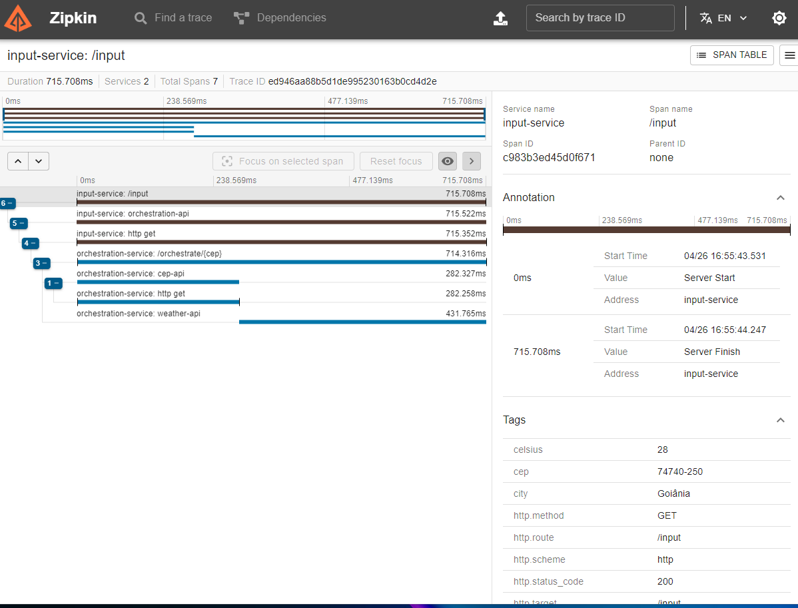

# Go Expert - Desfio Observabilidade
# desafioObservalityOtel

GO | OTEL | Zipkin | Docker

------
## Objetivo do desafio
Desenvolver um sistema em Go que receba um CEP, identifique a cidade e retorne o clima atual (temperatura em graus Celsius, Fahrenheit e Kelvin) junto com a cidade. Este sistema deverá implementar OTEL (Open Telemetry) e Zipkin.

Com base no cenário conhecido “Sistema de temperatura por CEP” denominado Serviço B, será incluído um novo projeto, denominado Serviço A.

### Descrição do Serviço A 
- O sistema deverá receber uma entrada de 8 dígitos via POST, utilizando o esquema: `{ "cep": "74740250" }`
- O sistema deverá validar se a entrada é válida (contém 8 dígitos) e é uma STRING
- Se válido, será encaminhado para o Serviço B via HTTP
- Se não for válido, deverá retornar:
- HTTP Code: 422
- Message: invalid zipcode

### Descrição do Serviço B 
- O sistema deve receber um CEP válido de 8 dígitos
- O sistema deverá realizar uma busca pelo CEP e encontrar o nome do local, a partir do qual deverá retornar as temperaturas e formatá-las como: Celsius, Fahrenheit, Kelvin junto com o nome do local.
- O sistema deverá responder adequadamente nos seguintes cenários:
- Em caso de sucesso:
- HTTP Code: 200
- Response Body: `{ "city": "Goiânia", "temp_C": 28.5, "temp_F": 28.5, "temp_K": 28.5 }`
- Em caso de falha, se o CEP não for válido (mas formatado corretamente):
- HTTP Code: 422
- Menssagem: invalid zipcode
- Em caso de falha, se o CEP não for encontrado:
- HTTP Code: 404
- Menssagem: can not find zipcode

Após a implementação dos serviços, adicione a implementação do OTEL + Zipkin:
- Implementar rastreamento distribuído entre o Serviço A - Serviço B
- Use span para medir o tempo de resposta do serviço de pesquisa de CEP e do serviço de pesquisa de tempratura

------ 
## Para executar o projeto localmente siga os seguintes passos:

1. `git clone https://https://github.com/michelpessoa/desafioObservalityOtel`
2. `go mod tidy` para instalar todas as dependências
3. Altere o valor da variável API Key no arquivo `docker-compose.yml`, incluindo uma válida
3. `docker-compose up --build` execute o comando para iniciar os serviços 

### Utilize algum client http para realizar as seguintes chamadas abaixo

#### Execute a request abaixo

curl --request GET --url http://localhost:8080/input --header 'Content-Type: application/json' --data '{ "cep": "74740-250" }'

### Analise o rastreio no Zipkin

1. Abra o navegar na url `http://localhost:9411/zipkin/`, clique em `RUN QUERY`
2. No resultado exebido, clique no botão `SHOW`
3. Será exebido o rastreio da chamada como um UUID no campo `Trace ID`, conforme exemplo:

